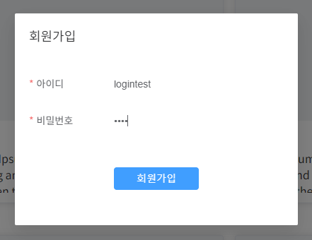
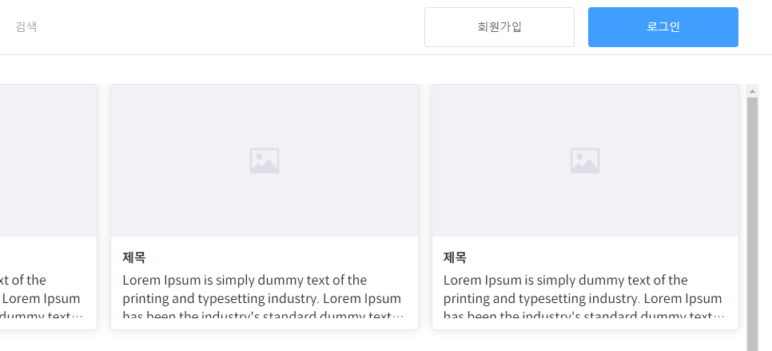

# 웹 기술 Backend

## subBranch2
<!-- 필수 항목 -->
## feature chat branch

## merge feature/chat
## Sub Project 1
2022/07/11 ~ 2022/07/15


#### 학습내용

프론트 - 백 로그인 기능 한 싸이클 돌려보기


#### 세부내용

* 회원가입 기능
* 로그인 기능
* 로그아웃 기능

#### 설명

##### 회원가입 기능


FE :
- vue 스켈레톤 코드의 login-dialog 코드를 참고하여 signup-dialog 코드를 작성
- form에 입력한 데이터를 서버(/api/v1/users)에 전달
- store의 action에서 axios통신을 활용해 전달

BE :
- PostMapping으로 전달받은 데이터를 @RequestBody를 통해 UserRegisterPostReq에 담고, JPA를 활용해 데이터 중복 확인 및 저장 작업을 수행
- 아이디가 중복될 시 405코드를 리턴, 회원가입 성공시 200코드를 리턴
```java
   @PostMapping()
   @ApiOperation(value = "회원 가입", notes = "<strong>아이디와 패스워드</strong>를 통해 회원가입 한다.") 
   @ApiResponses({
        @ApiResponse(code = 200, message = "성공"),
        @ApiResponse(code = 401, message = "인증 실패"),
        @ApiResponse(code = 404, message = "사용자 없음"),
        @ApiResponse(code = 500, message = "서버 오류")
    })
	public ResponseEntity<? extends BaseResponseBody> register(
			@RequestBody @ApiParam(value="회원가입 정보", required = true) UserRegisterPostReq registerInfo) {
		if(userRepository.existsByUserId(registerInfo.getId())){
			return ResponseEntity.status(405).body(BaseResponseBody.of(405, "Fail"));
		}
		else{
			User user = userService.createUser(registerInfo);
			return ResponseEntity.status(200).body(BaseResponseBody.of(200, "Success"));
		}
	}
```
   
##### 로그인 기능


FE : 
- 로그인 성공시 유저 데이터를 저장해야 된다
- 저장방법으로 1. vuex 2. sessionStorage 3. cookie 세가지 케이스를 고민
1. vuex의 경우 새로고침을 하거나 페이지를 이동할 때 초기화되는 문제가 발생
해결을 위해 vuex-persistedstate를 사용하는 것을 고려해봤으나 session으로 해결하고자 함
2. sessionStorage의 경우 vue3문법을 사용하면서 에러가 발생 -> cookie로 해결하고자 함
3. cookie의 경우 vue3의 useCookies를 활용해 로그인 정보 및 토큰을 성공적으로 저장
위 동작과정을 로그인 폼으로 서버에 데이터를 전송했을 때 return data에 따라서 동작시킴

BE :
- 로그인 폼으로 넘겨받은 데이터가 유효한지 확인
- getUserByUserId로 DB에 저장된 회원정보를 불러온 뒤, 입력받은 데이터와 일치한지 확인
- 비밀번호의 경우 인코딩을 한 뒤 일치한다면 200코드 리턴, 유효하지 않다면 401코드 리턴
   
##### 로그아웃 기능


FE : 
- 로그아웃 버튼 클릭시 cookie값을 초기화시키는 작업 수행
- 설계 계획 : state가 업데이트되면 해당 컴포넌트가 리렌더링되기 때문에 template에서 v-if 분기문을 통해 로그아웃 버튼과 회원가입/로그인 버튼을 동적으로 출력하고자함
- 어려움 : state값이 변경되어도 화면 리렌더링이 발생하지 않는 문제 발생
- vue2 -> vue3 업데이트 내용 중 state활용방법에 변화가 있었음
- 반응형 데이터를 포함하는 경우 반드시 computed를 사용해야 정상적인 리렌더링이 가능
``` javascript
   }),
      activeIndex: computed(() => store.getters['root/getActiveMenuIndex']),
      loginCheck: computed(() => cookies.get("loginCheck")),
    })
```

##### 추가 진행사항

   인프런 스프링, JPA 강의 수강하면서 프로젝트에 필요한 기술스택 공부

<!-- 필수 항목 -->

## 소개

웹 기술 프로젝트의 Backend 스켈레톤 코드

<!-- 필수 항목 -->

## 기술스택 및 라이브러리

| Project | Version | Description |
| ------- | ------- | ----------- |
| Java    | 1.8     |             |
| Gradle  | 6.7+    | Build Tool  |
| MySQL   |         |             |
|         |         |             |

<!-- 필수 항목 -->

## 개발 환경 구성

Windows 기준 개발 환경 구성 설명

1. OpenJDK 설치
   1. JDK 다운로드 사이트에서 1.8.x 설치 파일 다운로드 및 실행
      - Zulu OpenJDK: https://www.azul.com/downloads/?version=java-8-lts&package=jdk
      - OJDK Build: https://github.com/ojdkbuild/ojdkbuild
   2. 설치 후 명령 프롬프트(cmd) 확인
      ```
      > java -version
      ```
      출력 예)
      ```
      openjdk version "1.8.0_192"
      OpenJDK Runtime Environment (Zulu 8.33.0.1-win64) (build 1.8.0_192-b01)
      OpenJDK 64-Bit Server VM (Zulu 8.33.0.1-win64) (build 25.192-b01, mixed mode)
      ```

2. 데이터베이스 구성 *(이미 설치되어 있거나 원격 DB를 사용하는 경우 설치 부분 생략)*
   1. MySQL 다운로드 사이트에서 Community 설치 파일 다운로드 및 실행
      
      - https://dev.mysql.com/downloads/installer/
   2. MySQL Server, MySQL Shell을 포함하여 설치
   3. DB 및 계정 생성
      - MySQL Shell 실행
         ```
         MySQL  JS > \connect root@localhost
         MySQL  localhost:3306  JS > \sql
         ```
      - DB 생성
         ```sql
         create database IF NOT EXISTS `ssafy_web_db` collate utf8mb4_general_ci;
         ```
      - User 생성
         ```sql
         create user '사용자계정'@'localhost' identified by '비밀번호';
         grant all privileges on ssafy_web_db.* to 'ssafy'@'localhost';
         flush privileges;
         ```
      ```
      
      ```
   
3. IDE 설치 *(이미 설치되어 있거나 IntelliJ 등 다른 편집기를 사용할 경우 생략)*
   1. Eclipse 다운로드 사이트에서 Eclipse IDE 설치 파일 다운로드 및 실행
      - https://www.eclipse.org/downloads/
   2. Eclipse IDE for Enterprise Java and Web Developer 선택하여 설치
   3. Eclipse 실행 후 Encoding 변경
      - [Window] - [Preferences] - [General] - [Content Types] - [Text] - Default Encoding: UTF-8
      - [Window] - [Preferences] - [General] - [Workspace] - Text file encoding: UTF-8
   4. Spring Tools 3 설치
      - [Help] - [Eclipse Marketplace] - sts 검색 후 Spring Tools 3 설치
   5. Lombok 설치
      - [Help] - [Install New Software] - Work with: https://projectlombok.org/p2 입력 후 Lombok 설치 진행
   6. Eclipse 재시작   

4. 스켈레톤 다운로드 및 실행

   1. 프로젝트 다운로드
      ```
      git clone <repo URL>
      ```

   2. Eclipse의 [File] - [Import] - [Grade] - [Existing Gradle Project]에서 backend-java 폴더 선택 후 [Finish]
   
   3. Project Explorer에서 프로젝트 우클릭 후 [Spring] - [Add Spring Nature] 선택
      
   4. src/main/resources/application.properties 수정
   
      ```
   spring.datasource.hikari.username=<사용자 계정>
      spring.datasource.hikari.password=<비밀번호>
      ```
   
   5. [Gradle Tasks] 탭의 [Rub Gradle Tasks] 선택하여 실행


## 디렉토리 구조

```
.
└── main
    ├── generated
    ├── java
    │   └── com
    │       └── ssafy
    │           ├── GroupCallApplication.java
    │           ├── api  /* REST API 요청관련 컨트롤러, 서비스, 요청/응답 모델 정의*/
    │           │   ├── controller
    │           │   │   ├── AuthController.java
    │           │   │   └── UserController.java
    │           │   ├── request
    │           │   │   ├── UserLoginPostReq.java
    │           │   │   └── UserRegisterPostReq.java
    │           │   ├── response
    │           │   │   ├── UserLoginPostRes.java
    │           │   │   └── UserRes.java
    │           │   └── service
    │           │       ├── UserService.java
    │           │       └── UserServiceImpl.java
    │           ├── common /* 공용 유틸, 응답 모델, 인증, 예외처리 관련 정의*/
    │           │   ├── auth
    │           │   │   ├── JwtAuthenticationFilter.java
    │           │   │   ├── SsafyUserDetailService.java
    │           │   │   └── SsafyUserDetails.java
    │           │   ├── exception
    │           │   │   └── handler
    │           │   │       └── NotFoundHandler.java
    │           │   ├── model
    │           │   │   └── response
    │           │   │       └── BaseResponseBody.java
    │           │   └── util
    │           │       ├── JwtTokenUtil.java
    │           │       └── ResponseBodyWriteUtil.java
    │           ├── config /* WebMvc 및 JPA, Security, Swagger 등의 추가 플러그인 설정 정의*/
    │           │   ├── JpaConfig.java
    │           │   ├── SecurityConfig.java
    │           │   ├── SwaggerConfig.java
    │           │   └── WebMvcConfig.java
    │           └── db /* 디비에 저장될 모델 정의 및 쿼리 구현 */
    │               ├── entity
    │               │   ├── BaseEntity.java
    │               │   └── User.java
    │               └── repository
    │                   ├── UserRepository.java
    │                   └── UserRepositorySupport.java
    └── resources
        ├── README.md
        ├── application.properties /* 웹 리소스(서버 host/port, 디비 host/port/계정/패스워드) 관련 설정 정의 */
        ├── babel.config.js
        ├── dist
        ├── package-lock.json
        ├── package.json
        ├── public
```

